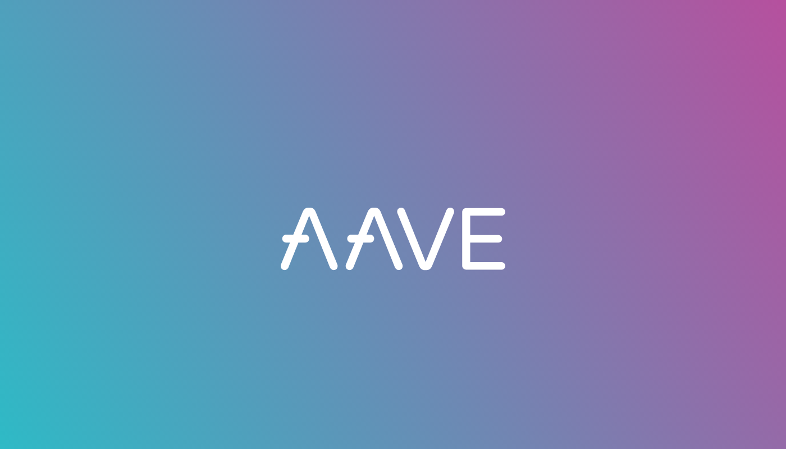

_Aave is an open source and non-custodial liquidity protocol for earning interest on deposits and borrowing assets._

[**Official Website**](https://aave.com/)

---

## 🇬🇷 Translation & Social Media Management

- [**Blog**](https://www.aave.gr/)
- [**Twitter**](https://twitter.com/AaveGR)

---

_Work in progress..._
