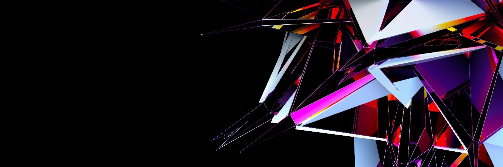

Ceramic is a decentralized, open source platform for creating, hosting, and sharing streams of data.

**🕸️ Website**: https://ceramic.network/

---

## 🇬🇷 Translation & Social Media Management

- **Blog**: https://ceramicnetworkgr.substack.com/
- **Twitter**: https://twitter.com/ceramic_net_gr
- **Discord Channel:** https://discord.gg/2EQ5RGhFNX
