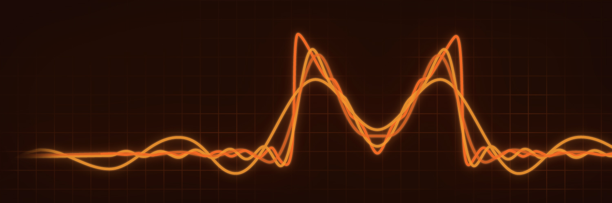

_Private, decentralized cryptocurrency that keeps your finances confidential and secure._

[**Official Website**](https://www.getmonero.org/)

---

## 🇬🇷 Greek Translation & Social Media Management

- [**Blog**](https://www.getmonero.gr/)
- [**Twitter**](https://twitter.com/MoneroGR)
- [**Website**](https://www.getmonero.org/el/index.html)
- [**GUI Wallet**](https://www.getmonero.org/el/downloads/#gui)
- **Subtitle**: [Monero: Sound Money, Safe Mode](https://youtu.be/aC9Uu5BUxII)
- **Subtitle**: [Monero Means Money](https://youtu.be/8quGD9W7B2I)

### Weblate Profiles

- [**Donald A. Iljazi**](https://translate.getmonero.org/user/oeAdgK01/)
- [**Iason Andreou**](https://translate.getmonero.org/user/zero-andreou/)

---

_Work in progress..._

---

## 🇪🇸 Spanish Translation

- [**Website**](https://www.getmonero.org/es/index.html)
- [**GUI Wallet**](https://www.getmonero.org/es/downloads/index.html)
- **Subtitle**: [Monero: Sound Money, Safe Mode](https://youtu.be/aC9Uu5BUxII)
- **Subtitle**: [Monero Means Money](https://youtu.be/8quGD9W7B2I)

### Weblate Profile

- [**Miguel Medina**](https://translate.getmonero.org/user/michaelizer/)

---

_Work in progress..._
