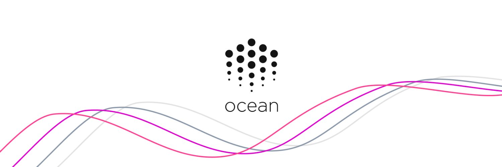

_Tools for the Web3 Data Economy_

[**Official Website**](https://oceanprotocol.com/)

---

## 🇬🇷 Greek Translation & Social Media Management

- [**Blog**](https://www.oceanprotocol.gr/)
- [**YouTube**](https://www.youtube.com/channel/UCFrXYCuoRpMBfzXud9W3nfA)
- [**Subtitles**](https://gist.github.com/Xk9eboF6/71b6182a5f4adf04ae483add553ba8b7)
- [**Twitter**](https://twitter.com/oceanprotocolgr)

## 🇬🇧 English Transcription

- [**YouTube**](https://www.youtube.com/channel/UCFrXYCuoRpMBfzXud9W3nfA)
- [**Subtitles**](https://gist.github.com/Xk9eboF6/9f0c853f5b28c3c10174da34e9575398)

---

_Work in progress..._

---

## 🇪🇸 Spanish Translation & Social Media Management

- [**Blog**](https://www.oceanprotocol.es/)
- [**Twitter**](https://twitter.com/OceanProtocolEs)

---

_Work in progress..._
