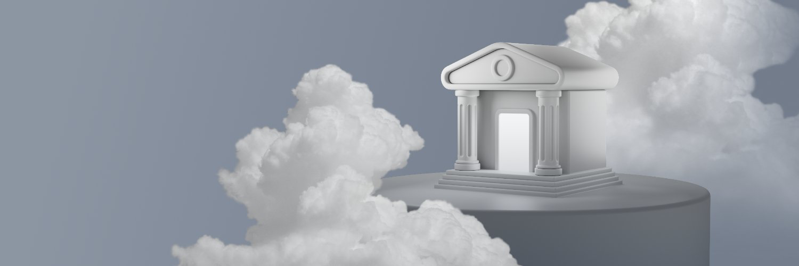

_Olympus is building a community-owned decentralized financial infrastructure to bring more stability and transparency for the world._

[**Official Website**](https://www.olympusdao.finance/)

---

## 🇬🇷 Greek Translation

- [**Medium**](https://olympusdao-gr.medium.com/)
- [**Agora Medium**](https://medium.com/@OlympusAgoraGR)
- [**Documentation**](https://docs.olympusdao.finance/main/v/greek/)
- [**Documentation Pro**](https://docs.olympusdao.finance/pro/v/greek-1/)
