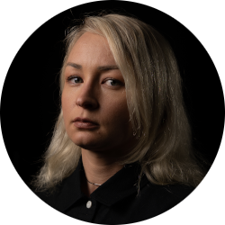

# Daria Dziouba

-

 
 

Daria Dziouba is a 29 years old female from Russia who holds a proficiency degree in English and has experience in the tourism industry as a tour guide. She holds a Master’s degree from the Russian International Academy for Tourism (RIAT).

 

---

## ℹ️ Information

### 📜 Certifications

- **Languages**: Native Russian, Proficiency in English
- **Studies**: Russian International Academy for Tourism (RIAT).

### 🧰 Tools of Trade

- **Office**: Microsoft Office (Word, Excel, PowerPoint, Teams), Google (Docs, Sheets, Forms, Slides).
- **Miscellaneous**: Airtable, Notion, GitHub, GitLab, Transifex, Crowdin, Medium, Substack.

### 📥 Contact

- **Twitter Profile**: [DariaDziouba](https://twitter.com/DariaDziouba)
- **Discord Handle**: dwraorange#3868
